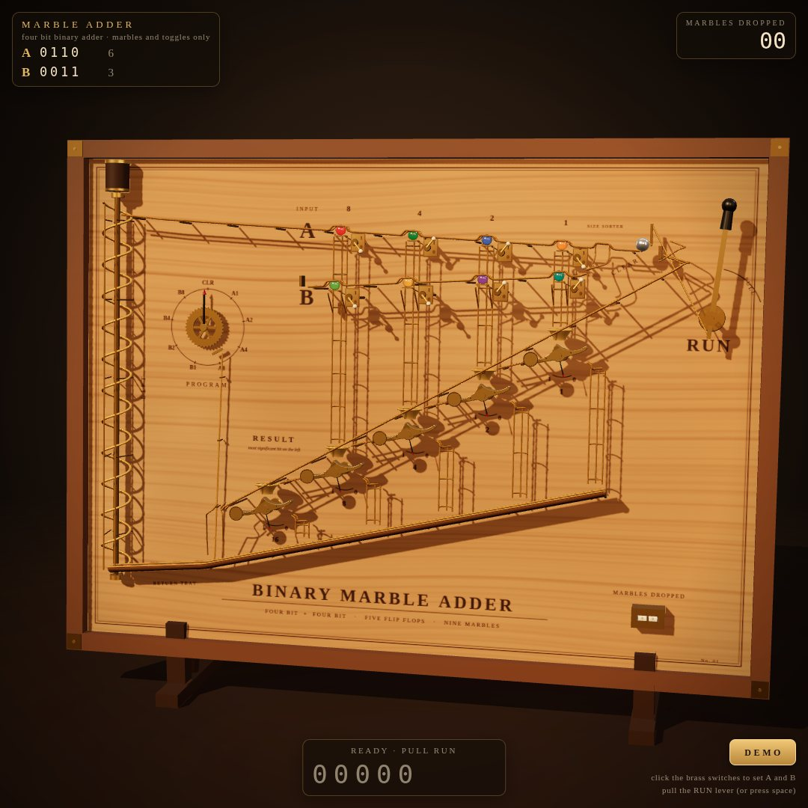
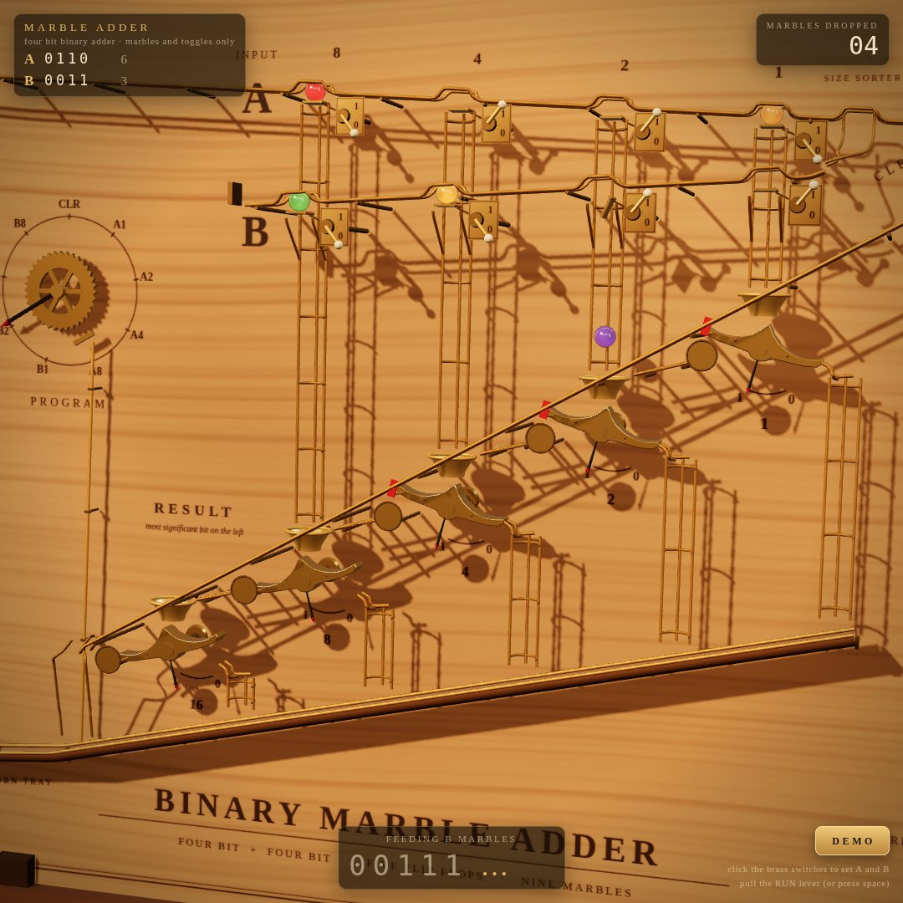
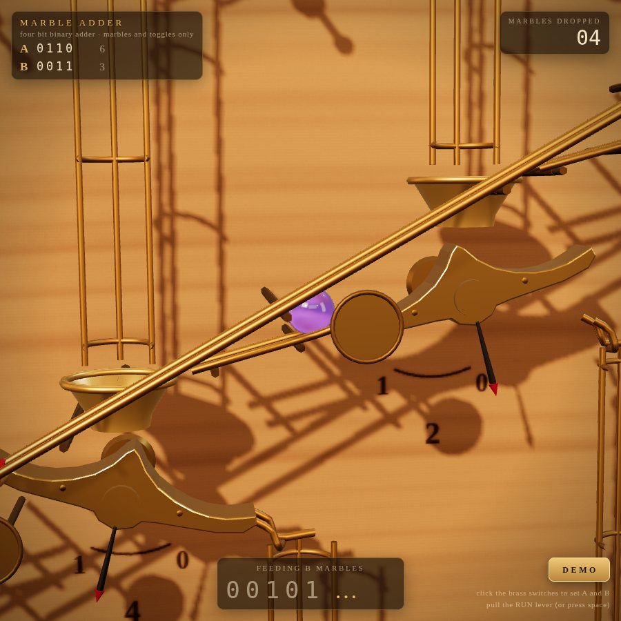
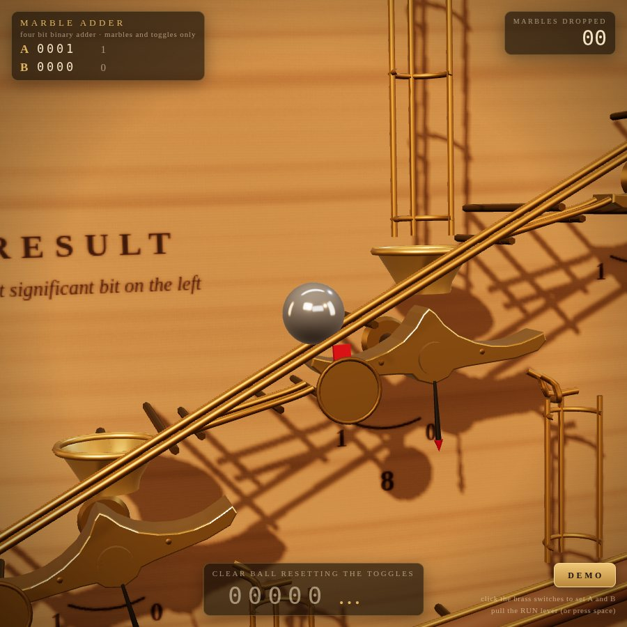
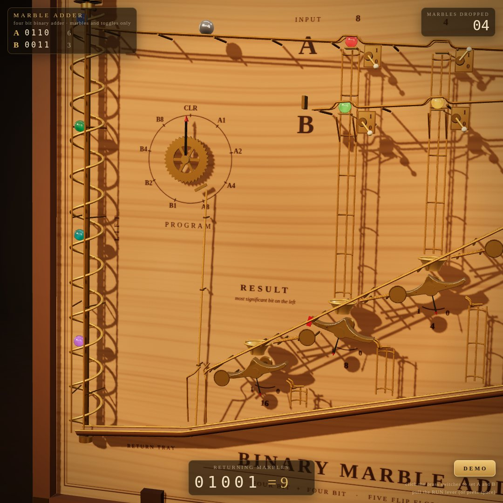

# Marble Adder

A four bit binary adder that computes with nothing but glass marbles falling through brass toggles. One HTML file, rendered live with Three.js, in the spirit of Wintergatan's Marble Machine and the Digi-Comp II.



This repository holds a single benchmark task: build a working marble computer as one self contained web page. The brief is reproduced below, followed by how the entry works, how it meets each rule, and how it was tested.

## At a glance

* **Deliverable:** [`index.html`](index.html), one file of about 96 KB (about 1,680 lines). Nothing else is needed to run it.
* **Libraries:** Three.js 0.169.0 and its OrbitControls addon, both from jsDelivr through an import map. No physics engine, no images, no font files, no audio files.
* **Correctness:** all 256 possible input pairs produced the correct five bit sum in automated testing, read back from the toggles after the last marble stopped.
* **Demo:** 5 + 6 = 11, then 9 + 7 = 16, then 15 + 15 = 30, hands free, in about 75 seconds.

## The brief

The task exactly as it was set:

```text
Build a single self-contained HTML file: a 3D marble computer, in the spirit of Wintergatan's marble machine and the Digi-Comp II, that adds two 4-bit numbers using nothing but marbles falling through mechanical toggles.

Hard rules:
1. One HTML file. Three.js from https://cdn.jsdelivr.net/npm/three@0.169.0 via an import map, plus its OrbitControls addon. No other libraries, no physics engine, no external assets.
2. The mechanism is the computer. Each bit of the result is stored in a two-state toggle (flip-flop) that a marble physically flips as it passes. Carries happen because a marble leaving one toggle rolls on to the next. Do not compute the answer in JavaScript arithmetic anywhere. The displayed result must be read from the toggle states after the last marble stops.
3. Marbles move along tracks with believable gravity and timing. Nothing teleports. You may script motion along paths, but every toggle flip must be caused by a marble arriving at it.
4. Input: two rows of four switches (A and B, 0 to 15), set by clicking. A lever labelled RUN releases the marbles. A counter shows how many marbles have fallen.
5. Output: a row of five result toggles, most significant bit on the left, and a readout that shows the binary and decimal value read from those toggles.
6. A DEMO button runs 5+6, then 9+7, then 15+15, resetting between runs, so it can be screen-recorded without touching anything.
7. Looks: a wooden board, brass toggles, glass marbles, warm studio lighting, soft shadows, a slow camera that follows the busiest part of the machine. It should look good in a square 1080x1080 recording.
8. Short click sounds via the Web Audio API when a toggle flips, started only after the first user click.
9. It must run at 60 fps on a normal laptop and have no console errors.

Output only the complete HTML file.
```

## Running it

1. Open `index.html` in a current desktop browser. It was developed and tested in Chromium. The page needs internet access, because Three.js loads from `cdn.jsdelivr.net`.
2. If your browser refuses module scripts on `file://` pages, serve the folder and open it over HTTP instead:

   ```sh
   python3 -m http.server 8000
   # then open http://localhost:8000/
   ```

3. Click once anywhere to enable sound. Browsers only allow audio after a user gesture, and the page does not try to start it earlier.

To make a recording, size the browser window to 1080 by 1080, press **DEMO**, and leave it alone.

## Controls

| Action | How |
|---|---|
| Set an input bit | Click a brass switch next to a pocket. Lever up is 1, lever down is 0. Switches are locked while a run is in progress. |
| Run | Click the **RUN** lever, or press Space or Enter. Pressing it while the marbles are still returning queues the run. |
| Demo | Click **DEMO** or press D. Click again to stop after the current run. |
| Look around | Drag to orbit, scroll to zoom. The automatic camera takes over again six seconds after you let go. |

The panel at the top left shows A and B in binary and decimal. The panel at the top right counts the marbles dropped in the current run (an odometer on the board counts the same thing). The panel at the bottom shows what the machine is doing and the result read from the toggles.

## A tour of the board

A front view, not to scale:

```text
  LIFT     top rail (A)   [A8]====[A4]====[A2]====[A1]====sorter====(ball park)   RUN
  screw    front rail (B) [B8]====[B4]====[B2]====[B1]==//                        lever
   ||                       ||      ||      ||      ||
   ||   PROGRAM             ||      ||      ||     (1)      the clear lane runs down
   ||    wheel              ||      ||     (2)              to the left, in front of
   ||                       ||     (4)                      every toggle
   ||                      (8)
   ||              (16)
   ||
   ||<== return tray <== trip lever <== collector gutter <=====================
```

1. **Screw lift** on the left edge. A rotating brass helix carries marbles from the return tray up to the top rail, one per turn.
2. **Top rail, row A.** Four pockets, one above each input column, each with a brass switch. At the right end are a size sorter gap and the park where the steel ball waits.
3. **Front rail, row B.** Four more pockets, 50 mm in front of the same columns, loaded through the sorter gap.
4. **RUN lever**, top right, linked to the gate of the ball's park.
5. **Program wheel**, left, with positions CLR, A1, A2, A4, A8, B1, B2, B4, B8. A push rod from the trip lever advances it.
6. **Result register.** Five brass rocker toggles in a staircase, worth 1 at the upper right down to 16 at the lower left. Each has a funnel above it, a needle dial below it and a red flag at its left end.
7. **Clear lane.** A rail in front of the toggles for the steel ball.
8. **Collector gutter and return tray.** Every marble ends here. The trip lever sits where the gutter meets the tray.
9. **Odometer**, bottom right, counting marbles dropped.

## How the machine adds



### The result toggles

Each bit of the sum lives in a brass rocker that pivots about its centre and always rests tilted one way or the other. Left arm down means 0; right arm down means 1. The top of the rocker is a W: a cup at each end and a fin in the middle. A marble dropping out of the funnel lands on the fin, which leans towards the lowered side, so the marble always rolls into the raised cup. Its weight then tips the rocker over, and it rolls out over the lip on the side that has just gone down.

| State before | Marble lands in | Rocker tips to | Marble leaves | Meaning |
|---|---|---|---|---|
| 0 | the right cup | right side down, now 1 | to the right, down a chute into the collector | bit set, this marble is finished |
| 1 | the left cup | left side down, now 0 | to the left, down a ramp into the next toggle's funnel | bit cleared, carry |

So a marble entering the toggle worth w adds w to the register. If that toggle held 0 it now holds 1. If it held 1 it drops to 0, and the same marble carries on into the toggle worth twice as much, where the same rule applies. This is a binary counter built from gravity, the same idea as the Digi-Comp II accumulator.

### Carries



Carries need gravity, so each toggle sits 100 mm lower and 180 mm further left than the one before. A carrying marble rolls off the left lip, down a short brass ramp and into the next funnel. That is why the five toggles form a diagonal row rather than a level one, with the most significant bit on the left as the brief asks. A carry that ripples through several toggles is literally one marble visiting each of them in turn.

### Feeding the inputs

Every input bit has its own glass marble waiting in a pocket above its column: the A pockets on the top rail and the B pockets on a rail in front of it. The brass switch beside each pocket is the latch for that pocket's gate. Lever up (1) lets the gate open; lever down (0) keeps it shut.

The program wheel releases the pockets one at a time in the order A1, A2, A4, A8, B1, B2, B4, B8, so the machine first counts A into the register and then adds B. The wheel is driven by the marbles. Every marble that finishes rolls over the trip lever at the mouth of the return tray, and the lever's push rod lets the wheel move on. When the wheel reaches a pocket whose switch is 1, the gate opens and the wheel waits until that marble has finished. When the switch is 0, the wheel runs straight past. So only one marble is ever inside the register, however long its carry chain turns out to be.

A released A marble falls straight down a brass cage into the funnel of the toggle with the same weight. A B marble first runs back through a short chute into the same cage.

### Clearing the register



Every run starts with a reset. Pulling RUN lifts the gate of the park, and a 32 mm steel ball rolls down the clear lane in front of all five toggles. Each toggle carries a red flag on its left arm. When the toggle holds 1, that arm is up, so the flag stands above a round brass shroud and into the ball's lane. When it holds 0, the flag is hidden behind the shroud, below the lane.

The ball pushes every raised flag down, which rotates that rocker back to 0, and passes over lowered flags without touching them. It then drops into the collector and rolls over the trip lever, and that trip is what starts the program wheel. So the reset is also done by something arriving at each toggle, as rule 3 demands, and the red flags double as a clear 1 indicator on screen.

### Bringing the marbles home



Every marble ends in the return tray, where they queue up with small bounces. When the result has been read, the screw lift starts and carries them up one per turn, at 0.4 m/s.

On the top rail each glass marble drops into the first empty pocket it reaches and rides up and over pockets that are already full. At each pocket, and at the sorter gap, the two rail rods spread apart to leave a 26.6 mm opening: wide enough for a 25 mm glass marble, too narrow for the 32 mm steel ball. Glass marbles therefore fill the A pockets, then drop through the sorter gap onto the B rail and fill those pockets, while the ball rolls over everything back to its park. There are nine places and nine marbles, so the machine always ends up fully reloaded without any hidden routing.

### Walkthrough: 5 + 6

A is 0101 and B is 0110. Register values are written 16 8 4 2 1.

| Step | What happens | Register |
|---|---|---|
| RUN pulled | The steel ball sweeps the lane and knocks down any raised flags | 00000 |
| A1 | Marble into the 1 toggle: 0 becomes 1, marble exits right | 00001 |
| A2 | Switch is 0, the wheel runs past | 00001 |
| A4 | Marble into the 4 toggle: 0 becomes 1 | 00101 |
| A8, B1 | Switches are 0, skipped | 00101 |
| B2 | Marble into the 2 toggle: 0 becomes 1 | 00111 |
| B4 | Marble into the 4 toggle: 1 becomes 0, the marble rolls on into the 8 toggle: 0 becomes 1 | 01011 |
| B8 | Skipped, the wheel returns to CLR | 01011 |
| Last marble stops | The toggles are read: 01011, shown as 11 | 01011 |

For 15 + 15 the first B marble ripples through four toggles and flips the 16 toggle, and the final reading is 11110 = 30.

## Requirements checklist

| Rule | How the entry meets it | Where to look in `index.html` |
|---|---|---|
| 1. One file, Three.js 0.169.0 via import map plus OrbitControls, nothing else | The import map maps `three` and `three/addons/` to jsDelivr. Everything else is generated in code: the wood grain and engravings are drawn on a canvas, reflections come from a procedural studio scene run through `PMREMGenerator`, sounds are synthesised, fonts are system fonts, and the favicon is an empty data URL so the page makes no failing requests. | `<script type="importmap">`, `buildEnvironment`, `woodCanvas`, `bakeBoardTexture`, `SFX` |
| 2. The mechanism is the computer | Each bit is `TOGGLES[k].state`, changed in exactly two places: `tipToggle` (a marble landed) and `flagHit` (the clear ball struck a raised flag). Carries are the path from one toggle into the next funnel. No code adds numbers. When the program wheel has finished and every marble is at rest, `readToggles()` joins the five states into a string; the decimal is `parseInt(bits, 2)` of that string, for display only. | `tipToggle`, `enterToggle`, `flagHit`, `readToggles`, `updateRun` |
| 3. Believable gravity, no teleporting, flips caused by arrivals | Marbles follow authored 3D paths. Along each one the speed comes from the component of gravity along the track (5/7 g for a rolling sphere, full g on near vertical drops), less rolling resistance and drag, integrated at 240 Hz. Every hand over starts exactly where the last path ended, including rides on moving parts: inside a tipping rocker's cup and on the lift screw. | `Path`, `stepMarble`, `tipToggle`, `tryPickup` |
| 4. Two rows of four clickable switches, a RUN lever, a counter | Brass switches on every pocket (row A on the top rail, row B on the front rail), picked by raycasting. The RUN lever is clickable, with Space or Enter as shortcuts. The odometer and the top right panel count marbles dropped in the current run. | `toggleSwitch`, `requestRun`, `releasePocket`, `setCounterTarget` |
| 5. Five result toggles, most significant bit on the left, binary and decimal readout | A staircase row with 16 at the left, each with a needle dial and a red 1 flag. While running, the readout shows the live toggle bits dimmed with no decimal; the final bits and decimal appear only once the last marble has stopped. | `updateHUD` |
| 6. DEMO runs 5+6, 9+7, 15+15 with resets | The demo flips the switches one by one (you see and hear each), pulls RUN, holds each result, lets the lift reload the pockets and the clear ball reset the register, then carries on. About 75 seconds in all. | `DEMO`, `updateDemo` |
| 7. Wooden board, brass, glass, warm light, soft shadows, slow camera | Procedural plywood with engraved labels in a walnut frame, brass toggles and wire rails, glass marbles with real refraction and coloured cores, a polished steel ball, warm key light with PCF soft shadows, and a camera that frames whatever is busiest (the lever, the clear sweep, the register, the result, the lift) on slow springs with a gentle sway. Composed for 1080 by 1080. | `desiredShot`, `updateCamera` |
| 8. Toggle clicks via Web Audio, only after the first click | Every flip plays a short filtered noise click with a pitched tock, a different note for each bit, so a ripple carry sounds like a falling arpeggio. The `AudioContext` is only created inside the first pointer or key event. | `SFX`, `firstGesture` |
| 9. 60 fps, no console errors | Geometry is merged down to about 200 draw calls per frame including the shadow and glass passes, the simulation costs about 0.06 ms per frame, and a quality governor steps down if frames run slow. No console errors or warnings appeared in any test. See the caveats below. | `mergeGroup`, `flushBuckets`, `governQuality` |

## How it was verified

The tests ran the real page in headless Chromium (Playwright 1.56) with SwiftShader software WebGL. The test sandbox could not reach jsDelivr, so the harness served the identical `three@0.169.0` package from npm by intercepting the CDN URLs; the file itself still loads from jsDelivr. To test quickly, the harness calls `window.__marble.advance(seconds)`, which runs the same simulation step the animation loop uses, just without drawing.

| Check | Result |
|---|---|
| All 256 input pairs, each through a full cycle (run, result, refill, ready) | 256 correct, none stuck. Longest cycle 29 s of machine time. |
| The demo | 01011 = 11, 10000 = 16, 11110 = 30, finishing at about 74 s of machine time |
| Real mouse clicks on a 3D switch and on the RUN lever | The switch changed and the run started |
| Space, D, and dragging to orbit | Worked as intended |
| Console during load, clicks, the demo and real time play | No errors and no warnings |
| Layout at 1080 x 1080, 1920 x 1080 and a 390 x 844 phone | Panels clear of each other and of the controls |

Timings: a run takes from about 3.5 s (0 + 0) to about 17 s (15 + 15) until the result is read, and returning the marbles takes about 5 to 11 s more.

Not verified:

* The frame rate on real laptop graphics. Software rendering says nothing about that, which is why the quality governor exists.
* The sound by ear. It was only checked for errors.
* Browsers other than Chromium.

### Check it yourself

With the page open, stop the demo if it is running, wait until the status says ready, then paste this into the browser console. It runs every input pair through the machine and compares the toggles with the expected sums. It freezes the tab for some seconds. The expected sums are calculated by this snippet only; the page itself never calculates them.

```js
(() => {
  const M = window.__marble, bad = [];
  const bits = v => v.toString(2).padStart(4, '0');
  for (let a = 0; a < 16; a++) for (let b = 0; b < 16; b++) {
    const A = bits(a), B = bits(b);
    for (let k = 0; k < 4; k++) { M.POCKETS[k].sw = +A[3 - k]; M.POCKETS[4 + k].sw = +B[3 - k]; }
    M.requestRun();
    let seen = false;
    for (let t = 0; t < 90; t += 0.5) {
      M.advance(0.5);
      if (M.RUNSTATE.phase === 'result') seen = true;
      if (seen && M.RUNSTATE.phase === 'ready') break;
    }
    if (parseInt(M.RUNSTATE.resultBits, 2) !== a + b) bad.push(`${a} + ${b} gave ${M.RUNSTATE.resultBits}`);
  }
  return bad.length ? bad : 'all 256 sums correct';
})();
```

## Performance

* Static parts are merged into one mesh per material, and each moving assembly into one mesh per material. The full view draws about 207 calls and 136,000 triangles per frame, counting the shadow and glass passes.
* The simulation (all marbles, the lift, the program wheel) costs about 0.06 ms per frame.
* The glass marbles use real transmission, which renders the opaque scene a second time. After a 2.5 s warm up the page looks at the median of each batch of 90 frames. If it is slower than 18.5 ms (about 54 fps) it steps down once per batch: first it caps the pixel ratio at 1.25 on high density screens, then it swaps to a cheaper transparent glass, then it drops to pixel ratio 1 and a 1024 shadow map. The starting pixel ratio is capped at 2.
* The on screen panels avoid backdrop blur, which is costly over a canvas that redraws every frame.

## Physical model and numbers

| Item | Value |
|---|---|
| Glass marbles | 8, each 25 mm across |
| Clear ball | 1 polished steel ball, 32 mm across |
| Gravity | 9.81 m/s², with the board leaning back 5 degrees like an easel |
| Rolling | 5/7 of the gravity component along the track, rising to full gravity on near vertical drops |
| Resistance | 0.16 m/s² rolling resistance plus quadratic drag set per track (the gutter and the clear lane have more) |
| Integration | fixed 240 Hz substeps |
| Board | 1.70 m by 1.23 m of plywood in a walnut frame |
| Toggle spacing | 180 mm across and 100 mm down per bit |
| Rocker tilt | 15 degrees either side of level |
| Collector | 13 degree gutter, then a 5 degree return tray |
| Lift | brass helix, 80 mm pitch, 5 turns a second, so 0.4 m/s |
| Sorter opening | 26.6 mm between rods |

## Code map

`index.html` reads from top to bottom in this order:

1. **Page and HUD.** Markup, CSS and the import map.
2. **Constants and layout.** Physical constants and the position of every part (`X`, `Y`, the rail heights).
3. **`Path`.** Rounded polylines with arc length lookup; every track is one of these.
4. **Geometry helpers.** Tubes, two rod rails, cages and a geometry merger.
5. **Renderer, scene, lighting.** Procedural studio environment, lights, materials and the glass material.
6. **Procedural wood and engravings.**
7. **Machine layout.** Every marble path: `PATHS`, `POCKETS` and the per toggle paths in `TOG`.
8. **Static geometry.** Rails, cages, funnels and the gutter (`buildStatic`).
9. **Moving parts.** Toggles, pocket gates and switches, park gate and RUN lever, program wheel, trip lever, screw lift and odometer.
10. **Board, frame, stand and floor.** `bakeBoardTexture`, `buildBoardAndStand`.
11. **Marbles.** The `Marble` class, `stepMarble`, and the routing that decides where each marble goes next from the state of the mechanism: `aRailEvents`, `tryPocket`, `releasePocket`, `enterToggle`, `tipToggle`, `joinGutter`, `launchClearBall`, `flagHit`, `tryPickup`, `updateLift`.
12. **Sequencer and run control.** `tripLever`, `updateSequencer`, `updateRun`, `requestRun`, `toggleSwitch`, and the demo (`updateDemo`).
13. **Sound.** `SFX`.
14. **Camera.** `desiredShot`, `updateCamera`.
15. **HUD, input, per frame animation, build and loop.** `updateHUD`, `animateParts`, `simulate`, `frame`, the quality governor, and the test hooks.

## Test hooks

`window.__marble` exposes the machine's state objects for inspection and the same control functions the page uses (`requestRun`, `setDemo`, `toggleSwitch`, `readToggles`), plus four helpers used by the automated checks:

* `advance(seconds)` runs the simulation forward without drawing.
* `look(px, py, pz, tx, ty, tz)` parks the camera and pauses the automatic camera.
* `screenOf('switch', i)` and `screenOf('lever')` give the on screen position of a control, so tests can click it with a real mouse event.
* `info()` returns renderer statistics.

None of them calculates a sum.

## Design decisions

* **Gate latches rather than deflectors.** Only the marbles for 1 bits fall, so the counter means something and the picture stays uncluttered.
* **A marble tripped program wheel rather than a timer.** It guarantees one marble at a time in the register, so two marbles can never meet inside a toggle, however long a carry chain runs.
* **A clear ball rather than a reset bar.** Rule 3 says every flip must be caused by a marble arriving, so the reset is a ball striking flags that only stand up for a 1.
* **A size sorter rather than hidden routing.** The steel ball finds its own way back to its park on every refill.
* **A lift, so nothing teleports.** The demo can run three sums in a row, and every marble visibly travels back to where it started.

## Known limitations

* Tracks are authored and the speed along them is simulated; marbles do not collide freely. Contact is modelled where marbles can actually meet: the queue in the return tray (with small bounces) and rolling over pockets that are already full.
* 60 fps has not been measured on real hardware. The quality governor is the safety net.
* Only tested in Chromium.
* Needs internet access for the jsDelivr CDN.
* Switches are locked while a run is in progress, and pressing RUN during a reset queues the run rather than starting it at once.

## Repository contents

| Path | What it is |
|---|---|
| `index.html` | The whole deliverable |
| `README.md` | This file |
| `docs/*.jpg` | The screenshots above, rendered in headless Chromium at 1080 by 1080 (the two close ups at 900 by 900) |
